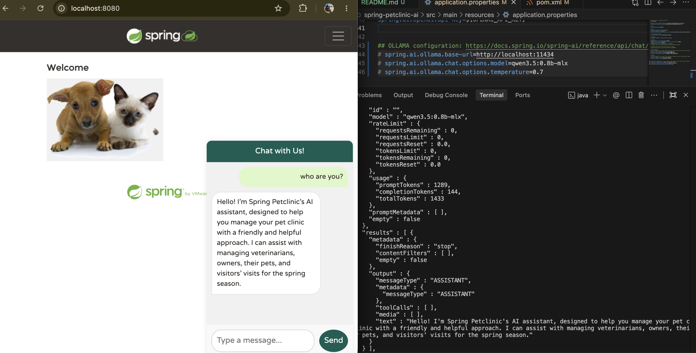

# Spring Pet Clinic AI

## prerequisites
1. Install Ollama: https://ollama.com/download
2. Pull the model: ollama pull qwen3.5:0.8b-mlx

## File updates

### pom.xml
- Remove spring ai starter model (azure openai or openai) dependency
```
    <dependency>
      <groupId>org.springframework.ai</groupId>
      <artifactId>spring-ai-starter-model-azure-openai</artifactId>
    </dependency>
```
- add spring ai ollama starter dependency
```
    <dependency>
      <groupId>org.springframework.ai</groupId>
      <artifactId>spring-ai-starter-model-ollama</artifactId>
    </dependency>
```

### application.properties
```properties
spring.ai.ollama.base-url=http://localhost:11434
spring.ai.ollama.chat.options.model=qwen3.5:0.8b-mlx
spring.ai.ollama.chat.options.temperature=0.99
```

### references
- https://docs.spring.io/spring-ai/reference/api/chat/ollama-chat.html
- 

# Steps to run locally
1. Run the application: ./mvnw spring-boot:run

